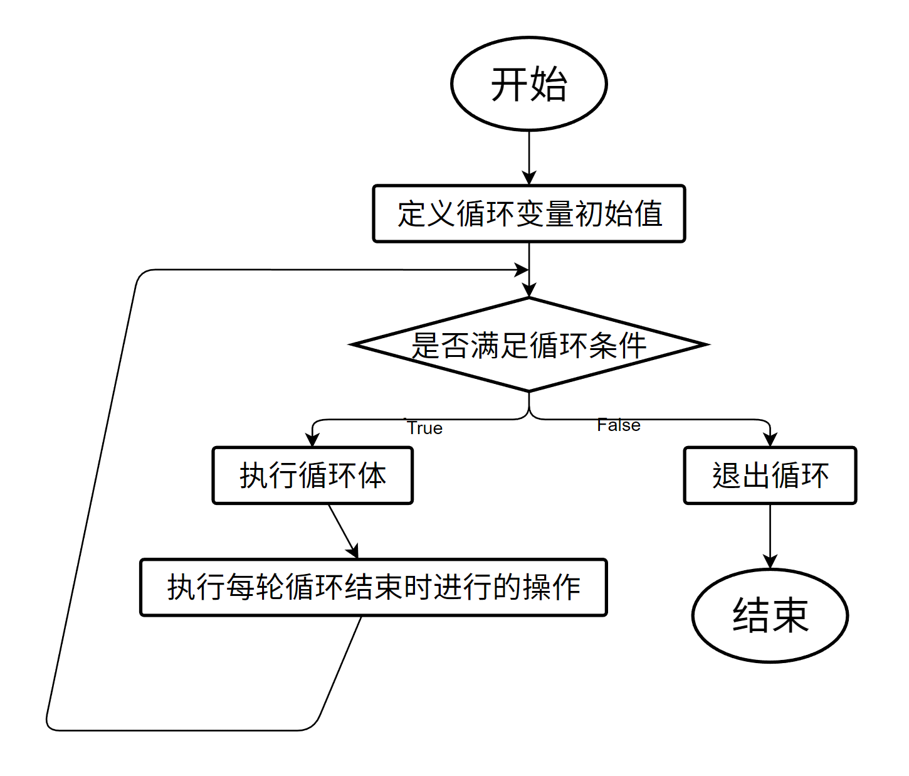

# Lesson 32

## 一、图论

### 1.1 图的概念

在学习之前，先来了解几个名词的意思：

* **图**（graph），由有限个数的顶点以及顶点之间边所组成，通常表示为 $$G(V, E)$$（其中 G 表示一个图，V 表示图 G 中顶点的集合，E 为图 G 中边的集合）；
* **顶点**，指的是图中的数据元素，相似于树结构中的节点；
* **无向图**，是图的一种，无向图中任意顶点上的**边都是无方向性的**，无向边通常表示为 $$(V_i, V_j)$$（$$V_i$$ 和 $$V_j$$ 分别是其两端的两个顶点）；
* **有向图**，是图的一种，有向图中任意顶点上的**边都是有方向性的**，有向边通常表示为 $$\langle V_i, V_j\rangle$$（$$V_i$$ 和 $$V_j$$ 分别是其起始顶点与结束顶点），一条有向边可以看作一个向量；
* **有向完全图**，是有向图的一种，指的是图中任意两个顶点之间**都存在方向互为相反的两条边**的有向图；
  * **有向完全图的性质**：一般地，含有 n 个顶点的有向完全图有 $$n(n-1)$$ 条边。
* **无向完全图**，是无向图的一种，指的是图中任意两个顶点之间**都存在边**的无向图的无向图；
  * **无向完全图的性质**：一般地，含有 n 个顶点的无向完全图有 $$\dfrac{n(n-1)}{2}$$ 条边。
* **子图**，指的是图中取出的部分集合，相似于树结构中的子树；
* **度**：一个顶点的度指的是与该顶点相关联的边的数目；
  * **入度**：有向图中一个顶点的入度指的是以该顶点为终点的有向边的数目；
  * **出度**：有向图中一个顶点的出度指的是以该顶点为起点的有向边的数目。
* **权值**，指的是边的“费用”，可以形象地理解为边的长度；
* **回路**，指的是起点和终点相同的路径，也称为**环**；
* **连通图形**：在**无向图**中，**任意两点都可通过路径连通**的图形，称为连通图形；
* **强连通图形**：在**有向图**中，**任意两个顶点之间皆存在一条路径可到达对方**的图形，称为强连通图形；
* **强连通分量**：在有向图中，**任意两点都可通过路径连通**的**顶点数量最大**子图（包括**单个顶点**），称为强连通分量；
* **邻接数组**，是一种用来表示图的方法：以一个 $$n\times n$$ 的数组来表示一个具有 n 个顶点的图形。
  * **无向图**中，处于数组中 `[Vi][Vj]` 或 `[Vj][Vi]` 位置的值，表示顶点 $$V_i$$ 和顶点 $$V_j$$ 之间是否有无向边，如果有则值为 1，如果没有则值为 0；
  * **有向图**中，处于数组中 `[Vi][Vj]` 位置的值，表示图中是否有一条起点为顶点 $$V_i$$ 且终点为顶点 $$V_j$$ 的有向边，如果有则值为 1，如果没有则值为 0；
  * **带权值的图**中，处于数组 `[Vi][Vj]` 位置的值，表示图中顶点 $$V_i$$ 与顶点 $$V_j$$ 之间的边的权值，如果这个值为 0，表示这两个顶点之间没有边。

### 1.2 图的应用

假定我们给出这样一幅无向图：

.png>)

那么我们就可以写出这个无向图的邻接数组，形象化如下图所示：



对这个图，我们还可以通过深搜和广搜进行搜索，其规则不变。

* 使用深搜，搜索的顺序（同级顶点从小到大）为 1 → 2 → 5 → 3 → 4；
* 使用广搜，搜索的顺序（同级顶点从小到大）为 1 → 2 → 3 → 4 → 5。

#### 1.2.1 图的基本搜索

给定一个无向图的顶点数量、边的数量以及各条边的两个顶点，每条边的权值都为 1。请输出这个无向图的邻接数组。

```cpp
# include <iostream>
using namespace std;

// 顶点  边   顶点   图的邻接数组
int v, edge, a, b, g[105][105];

int main () {

    cin >> v >> edge;
    for (int i = 1; i <= edge; i++) {
        cin >> a >> b;
        // 将这条边的两个顶点都记为1
        g[a][b] = 1, g[b][a] = 1;
    }
    
    for (int i = 1; i <= v; i++) {
        for (int j = 1; j <= v; j++) 
            cout << g[i][j] << " ";
        cout << endl;
    }
    
    return 0;
}
```

#### 1.2.2 图的深度优先搜索

给定一个无向图的顶点数量、边的数量以及各条边的两个顶点，每条边的权值都为 1。请输出使用深搜对该无向图搜索时访问各个顶点的顺序。

```cpp
# include <iostream>
using namespace std;

int v, e, a, b, g[105][105];
bool book[105];

void dfs(int x) { // 开始搜索的顶点x
    cout << x << " "; // 输出序列
    for (int i = 1; i <= v; i++) { // 从1开始遍历每个顶点与x相匹配
        if (!book[i] && g[x][i]) { // 如果没有访问过且有边连接
            book[i] = 1; // 标记这个顶点为已走过
            dfs(i); // 从匹配的顶点向下开始搜索
        }
    }
    return; // 如果全部顶点都匹配完了就返回
}

int main () {
    cin >> v >> e;
    for (int i = 1; i <= e; i++) {
        cin >> a >> b;
        g[a][b] = 1, g[b][a] = 1;
    }
    book[1] = 1; // 初始化首个顶点的值
    dfs(1); // 深搜
    return 0;
}
```

#### 1.2.3 图的广度优先搜索

给定一个无向图的顶点数量、边的数量以及各条边的两个顶点，每条边的权值都为 1。请输出使用广搜对该无向图搜索时访问各个顶点的顺序。

```cpp
# include <iostream>
using namespace std;

int v, e, a, b, g[105][105], t;
bool book[105]; int q[11025], hh, tt;

void bfs(int x) {
    q[tt++] = x; // 存储队尾元素
    while (hh < tt) { // 如果队列不为空
        t = q[hh++]; // 暂存队首元素并将其出队
        cout << t << " "; // 输出队首元素
        for (int i = 1; i <= v; i++) { // 从1开始遍历每个顶点与x相匹配
            if (!book[i] && g[t][i]) { // 如果没有访问过且有边连接
                book[i] = 1; // 标记这个顶点为已走过
                q[tt++] = i; // 将下一个顶点入队
            }
        }
    }
    return;
}

int main () {
    cin >> v >> e;
    for (int i = 1; i <= e; i++) {
        cin >> a >> b;
        g[a][b] = 1, g[b][a] = 1;
    }
    book[1] = 1; // 初始化队首元素
    bfs(1); // 广搜
    return 0;
}
```

## 二、文件输入输出流

### 2.1 文件输入输出是什么

通常我们在计算机本地运行代码时，需要手动输入输入数据。在某一些程序中，输出数据与输入数据是混杂在一起的。而在算法竞赛中，输入数据与输出数据分装在两个不同的文件中，分别是 `in` 文件与 `out` 文件。在算法竞赛的赛场上，我们不使用命令提示符输入数据，而是读取输入文件来获取输入数据，并将运行的结果写入输出文件。评测机评测程序写得正确与否时，会提供输入数据，经由程序读入、处理、输出之后生成输出文件，再与正确的输出文件相匹配，如果二者完全匹配（通常会忽略掉末尾的空格与换行符），就判这一个测试点 AC。

### 2.2 如何使用文件输入输出

使用文件输入输出需要使用 `cstdio` 头文件。文件输入输出的主要代码如下：

```cpp
#include <iostream>
#include <cstdio>
using namespace std;

int main() {
    freopen("file.in", "r", stdin); // 请注意文件的扩展名为in和out(不是txt)
    freopen("file.out", "w", stdout); // 如果目录中没有file.out文件则会自动创建
    // 程序主体
    fclose(stdin);
    fclose(stdout); // 关闭文件
    return 0;
}
```

### 2.3 文件输入输出的应用

拿我们做过的题目《数字三角形》（动态规划解法）为例。

在程序同级目录下准备好输入文件 `triangle.in`：

```
5
7
3 8
8 1 0
2 7 4 4
4 5 2 6 5
```

就可以运行程序了：

```cpp
# include <bits/stdc++.h>
# define N 1005
using namespace std;

int n, a[N][N];

int main() {
    
    // 输入输出文件
    freopen("triangle.in", "r", stdin);
    freopen("triangle.out", "w", stdout);
    
    // 从输入文件输入值并存入n
    cin >> n;
    for (int i = 1; i <= n; i++)
        for (int j = 1; j <= i; j++)
            // 从输入文件输入值并存入数组a
            cin >> a[i][j];
            
    for (int i = n-1; i >= 1; i--)
        for (int j = 1; j <= i; j++)
            a[i][j] += max(a[i+1][j], a[i+1][j+1]);
    
    // 将数组第一个值输出到输出文件里
    cout << a[1][1];
    
    // 关闭文件
    fclose(stdin);
    fclose(stdout);
    
	return 0;
}
```

运行时会弹出命令提示符，但是不会有数据，只会显示程序运行时间，这个值就是单纯运行代码所耗的时间，也是评测机判断运行时间是否超限（TLE，time limit exceeded）的依据。运行完之后，在同级目录下打开生成的 `triangle.out` 文件，就可以发现其中有运行的结果：

```
30
```
