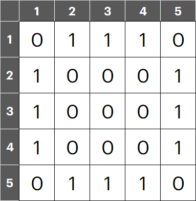

# Lesson 5


请注意，在本页面所显示的代码段中，可能出现行内缩进过多或过少等现象，这是不同笔记软件和集成开发环境所预设的制表符长度不同所导致的，属正常现象。


## 一、复习

### 题目描述

买了一箱 n 个苹果（$$n \gt 0$$），其中有一条虫子以每 x 小时 1 个苹果的速度吃苹果（$$x \neq 0$$），假设虫子在吃完一个苹果之前不会去吃其他苹果，那么 y 小时后还有多少个苹果？

### 输入与输出要求

* 输入：仅一行，一次分别为 n、x、y（均为整数）；
* 输出：仅一行，剩下的苹果个数。

### 样例

* 输入 `10 4 9`；
* 输出 `7`。

### 解答

```cpp
#include <iostream>
using namespace std;
int main() {
	int n, x, y, ans = 0;
	cin >> n >> x >> y;
	ans = n - y/x;
	if (y%x != 0) ans -= 1;
	cout << ans;
	return 0;
}
```

## 二、循环结构

综合本课与前几课时学习的内容，可以知道程序结构主要分为**顺序结构**、**选择结构**、**循环结构**三种。

循环结构可以简单理解为**使程序做重复的事情**。

### 2.1 for 语句

#### 2.1.1 一般结构

```cpp
for (循环变量初始值; 循环条件; 每轮循环结束时进行的操作) {
    // 循环体
}
```

以下是一个例子——

```cpp
for (int i = 1; i <= 10; i++) {
    cout << i << " ";
}
```

这几行代码的效果是，不断输出从 1 开始的整数，直到 10 为止。至此，可以理解 for 语句的运行规则，以上例为例：

* 在首次循环开始时定义循环变量 `i = 1`，判断 `i <= 10` 成立，因此输出 `i` 和一个空格，循环体执行完后 `i` 自增 1；
* 在接下来的每轮循环中，先判断 `i <= 10` 是否成立，如果成立则执行循环体，接着 `i` 自增 1；
* 最后一次循环时，`i = 11`，故 `i <= 10` 不成立，结束循环。



**应用一**

输入 n 与 m，输出 n 到 m 中的所有偶数（n 与 m 均为整数且在 `int` 范围内，包含 n 与 m 自身，输出的偶数均以空格分隔）。

```cpp
#include <iostream>
using namespace std;
int main() {
	int n, m;
	cin >> n >> m;
	for (int i = n; i <= m; i++) {
		if (i % 2 == 0) {
			cout << i << " ";
		}
	}
	return 0;
}
```

**应用二**

打擂台算法：给出 n 和 n 个整数，求这 n 个整数中的最小值。输入的第一行为 n，第二行为这 n 个整数（以空格分隔）；输出只有一行，为这 n 个整数中的最大值。

```cpp
#include <iostream>
using namespace std;
int main() {
	int n, temp, max = -1;
	cin >> n;
	for (int i = 1; i <= n; i++) {
		cin >> temp;
		if (temp > max) max = temp;
	}
	cout << max;
	return 0;
}
```

原理：在每一次循环中让读入的一个整数 `temp` 与当前的最大值 `max` 相比较（第一次循环时与 `max = -1` 相比较），比较后 `max` 被替换为其中的较大值。假设我们输入 5 个整数，分别为 5、3、4、2、6，则有如下情况：

| i     | i <= n | temp | max | 判断大小后赋值 | 循环结束后 |
| ----- | ------ | ---- | --- | ------- | ----- |
| 1（初始） | True   | 5    | -1  | max = 5 | `i++` |
| 2     | True   | 3    | 5   | max = 5 | `i++` |
| 3     | True   | 4    | 5   | max = 5 | `i++` |
| 4     | True   | 2    | 5   | max = 5 | `i++` |
| 5     | True   | 6    | 5   | max = 6 | `i++` |
| 6     | False  |      |     |         |       |
